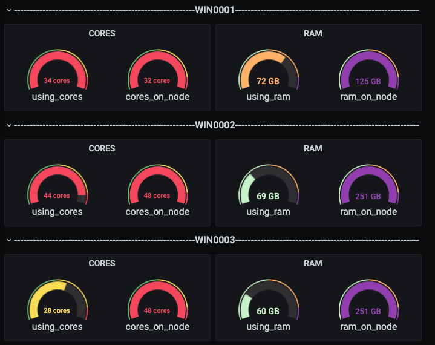
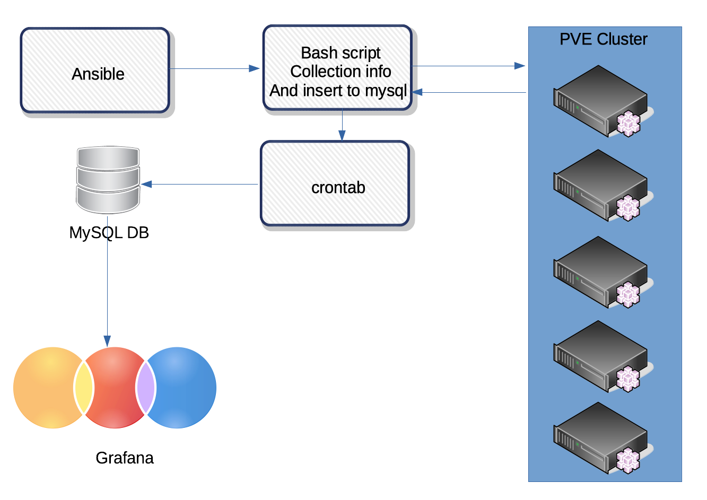

[RU](README.md) [EN](README_EN.md)
### Введение
В связи с отсутствием из "коробки" у платформы виртуализации ProxMox отображения суммы фактически выделенных виртуальных ресурсов на физических хостах, было принято решения собирать данные с хостов кластера складывать их в БД MySQL и отправлять их в Grafana, для визуализации. Т.к. не всегда хочется высчитывать сколько же оперативки еще осталось на ноде и на какой из нод лучше запускать ВМ. В конечном итоге все выглядит вот так(что не много упрощает жизнь):

### Схема и принцип работы

1. При помощи Ansible [prepare_pvesrv_for_grafana.yml](playbooks/prepare_pvesrv_for_grafana.yml) раскладываем скрипт на все необходимые нам хосты ProxMox кластера и добавляем запуск скрипта в cron.(Предварительно изменив переменные на то что нужно)
2. Затем складываем скрипты:
* [create_db_for_grafana.sh](scripts/create_db_for_grafana.sh)
* [create_tables_grafana.sh](scripts/create_tables_grafana.sh)
* [first_insert_data_to_grafana.sh](scripts/first_insert_data_to_grafana.sh)
* [main_insert_data_to_grafana.sh](scripts/main_insert_data_to_grafana.sh)

 на сервер MySQL и добавляем в cron скрипт [main_insert_data_to_grafana.sh](scripts/main_insert_data_to_grafana.sh)

3. При первичном сборе данных необходимо запустить все скрипты в ручную, после этого все будет автоматически складываться через cron. Запуск скриптов нужно произвести в следующем порядке:  

 3.1 [collection_pve_reserved.sh](scripts/collection_pve_reserved.sh) - скрипт сбора данные и отправки на сервер MySQL(тот что мы рассылали через Ansible). Посредством того че Ansible запускаем его на всех хостах ProxMox

 3.2 [create_db_for_grafana.sh](scripts/create_db_for_gragana.sh) - скрипт создает БД (Предварительно изменив переменные на то что нужно)

 3.3  [create_tables_grafana.sh](scripts/create_tables_grafana.sh) - скрипт создает таблицы в БД с названиями хостов

 3.4  [first_insert_data_to_grafana.sh](scripts/first_insert_data_to_grafana.sh) - превичное заполнение данных

4. Затем ставим плагин MySQL в Grafana и используем его в качестве DataSource с которого можно забирать и визуализировать данные.
