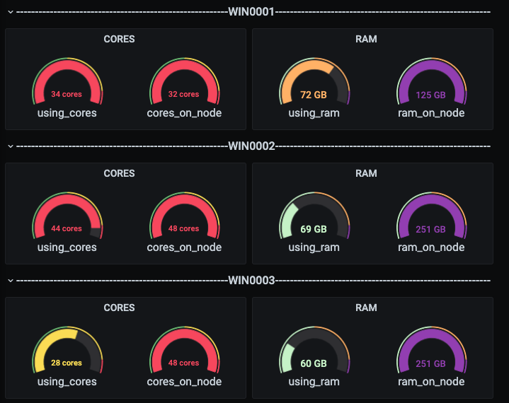
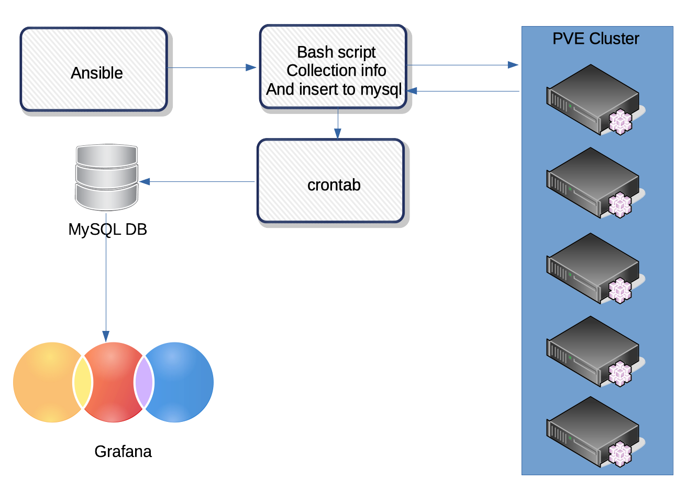

[RU](README.md) [EN](README_EN.md)

##### Sorry for the clumsy translation, I used google translate

### Introduction
Due to the fact that the ProxMox virtualization platform does not display the sum of actually allocated virtual resources on physical hosts out of the box, it was decided to collect data from the cluster hosts, put it in the MySQL database and send it to Grafana for visualization. Because I do not always want to calculate how much RAM is still left on the node and on which of the nodes it is better to run the VM. In the end, everything looks like this (which does not make life much easier):

### Scheme and principle of operation

1. Using Ansible [prepare_pvesrv_for_grafana.yml](playbooks/prepare_pvesrv_for_grafana.yml) we expand the script to all the hosts of the ProxMox cluster we need and add the script launch to cron.
2. Then add the scripts:
* [create_db_for_grafana.sh](scripts/create_db_for_grafana.sh)
* [create_tables_grafana.sh](scripts/create_tables_grafana.sh)
* [first_insert_data_to_grafana.sh](scripts/first_insert_data_to_grafana.sh)
* [main_insert_data_to_grafana.sh](scripts/main_insert_data_to_grafana.sh)

 to the MySQL server and add the script [main_insert_data_to_grafana.sh](scripts/main_insert_data_to_grafana.sh) to the cron

3. When collecting data for the first time, it is necessary to run all the scripts manually, after that everything will be automatically added via cron. The scripts must be run in the following order:

 3.1 [collection_pve_reserved.sh](scripts/collection_pve_reserved.sh) - a script for collecting data and sending it to the MySQL server (the one that we sent via Ansible). Using Ansible, we run it on all ProxMox hosts

 3.2 [create_db_for_grafana.sh](scripts/create_db_for_gragana.sh) - the script creates a database (after changing the variables to what is needed)

 3.3 [create_tables_grafana.sh](scripts/create_tables_grafana.sh) - the script creates tables in the database with host names

 3.4 [first_insert_data_to_grafana.sh](scripts/first_insert_data_to_grafana.sh) - filling the data first

4. Then install the MySQL plugin in Grafana and use it as a DataSource from which you can retrieve and visualize data.
